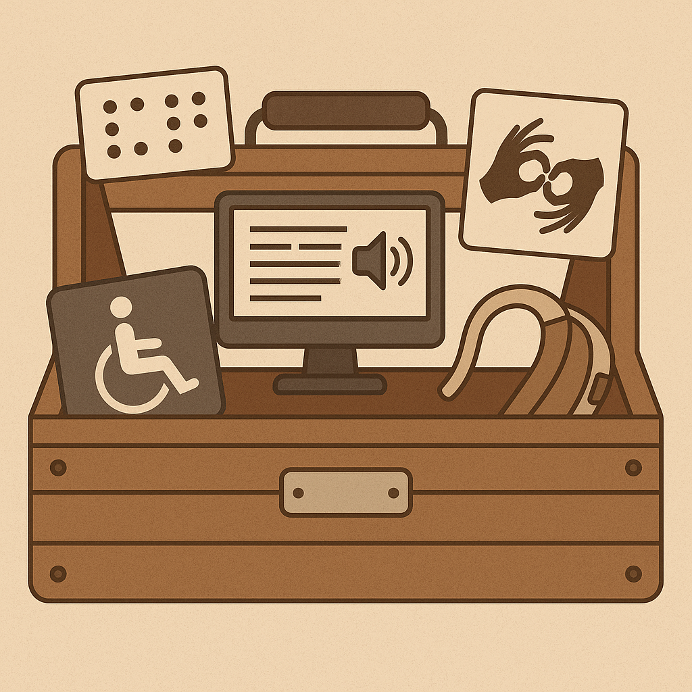

# City of Sault Ste. Marie Accessibility Toolbox

## Accessibility Checklists

Lists of things to check before sharing documents publically.

✅ [**Basic Accessibility Checklist**](./basicAccessibilityChecklist/README.md)

✅ [**PDF Accessibility Checklist**](./pdfAccessibilityChecklist/README.md)

✅ [**Microsoft Word Accessibility Checklist**](./wordAccessibilityChecklist/README.md)

## Accessibility Tools

### Cloud-Based Tools

⭐ [**PAVE - PDF Accessibility Validation Engine**](https://pave-pdf.org/index.html)
 
A web application that identifies issues with PDF documents and _helps fix them_!

[**Who Can Use**](https://www.whocanuse.com/) 
Simulates how the foreground and background colour choices in your documents
and publications are perceived by readers with visual impairments like colour blindness.

### Downloadable Tools

💡 You may require assistance from IT to install applications on your machine.

⭐ [**PDF Accessibility Checker (PAC)**](https://pac.pdf-accessibility.org/en) 
A free tool to evalulate PDF files, and report on any identified accessibility issues.

## Courses

[**City of Peterborough - Intro to Accessible Documents**](https://peterboroughcourses.esolg.ca/en/accessibilitycourses/IAS105/index.html#/) 
A full course that discusses the key concepts of creating accessible documents.

[**City of Peterborough - Creating Accessible PDFs**](https://peterboroughcourses.esolg.ca/en/accessibilitycourses/IAS105E/index.html#/) 
An fully interactive course that guides you though the process of
using Acrobat Pro to create accessible PDFs.

## Workshops

Hands on activities to polish your accessibility skills!

[**National AccessAbility Week Demo - Browsing Websites Using a Keyboard**](https://cityssm.github.io/tip-of-the-month/2025/06-jun/browsing-websites-using-a-keyboard.html) 
Can you browse the websites for the information you need using only your keyboard?

[**Accessibility Demo 2024 - PDFs and Screen Readers**](https://cityssm.github.io/accessibility-demo-2024/) 
Test problematic PDFs. Can you identify the problems? Do you know how to fix them?
