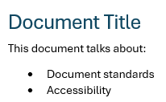
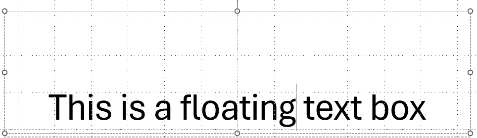
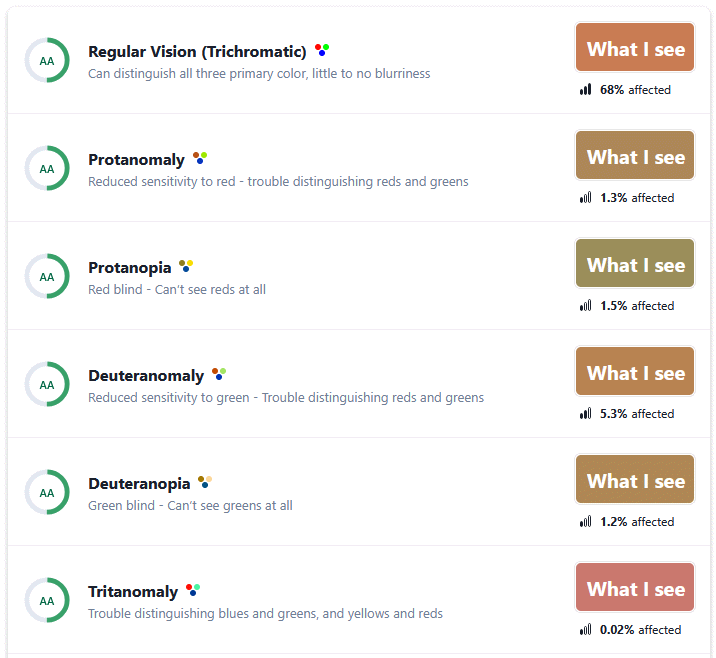

[Home](https://cityssm.github.io/accessibility-toolbox/)

# Basic Accessibility Checklist

**Under development. More checks coming.**

- [Use proper content structure](#-use-proper-content-structure)
- [Speak clearly](#-speak-clearly)
- [Label figures and images with alternative text](#-label-figures-and-images-with-alternative-text)
- [Follow a logical reading order](#-follow-a-logical-reading-order)
- [Ensure good colour contrast](#-ensure-good-colour-contrast)

## ✅ Use proper content structure

Use headings for headings, lists for lists, and tables for tables.

When you use the structure elements tools like Microsoft Word provides,
those elements (and their structural meanings) are communicated
to assistive technologies.

## ✅ Speak clearly

- Use plain language.
- When using abbreviations and acronyms, always define them on first use.
- Ensure images have enough quality to appear blurry or pixelated.
- Ensure information isn't conveyed by colour alone.

## ✅ Label figures and images with alternative text

Alternative text is used to describe images and figures to users
who may not be able to see or understand the image without assistance.

[Learn more about writing good alternative text](https://cityssm.github.io/tip-of-the-month/2024/03-mar/alternative-text.html).

## ✅ Follow a logical reading order

Tools like Microsoft Powerpoint can create floating text boxes and images.
Oftentimes, floating items are inserted outside of the "visual" reading order,
at the end of the document. If the document will be consumed on a machine,
it is recommended to avoid floating items to maintain a proper reading order.

## ✅ Ensure good colour contrast

Not everyone has perfect vision. It is important to ensure a good
colour contrast exists between foreground and background colours.

A tool like [Who Can Use](https://www.whocanuse.com) can help test
combinations and simulate what they may look like for users with
different types of colour blindness.
