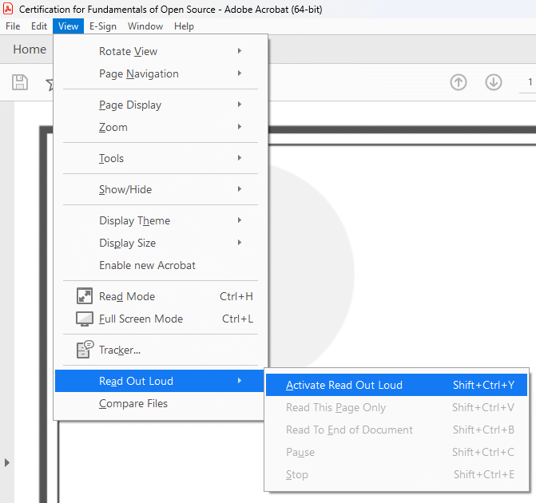

[Home](https://cityssm.github.io/accessibility-toolbox/)

# PDF Accessibility Checklist

**Under development. More checks coming.**

- [Ensure wherever possible the document comes from a digital source](#-ensure-wherever-possible-the-document-comes-from-a-digital-source)
- [Ensure "Document Properties" are set](#-ensure-document-properties-are-set)
- [Ensure the "Read Out Loud" feature is working properly](#-ensure-the-read-out-loud-feature-is-working-properly)
- [Ensure the document passes the "Basic Accessibility Checklist"](#-ensure-the-document-passes-the-basic-accessibility-checklist)
- [Complete Acrobat's "Accessibility Check"](#-complete-acrobats-accessibility-check)

## ✅ Ensure wherever possible the document comes from a digital source

Nothing wipes our accessibility on a document like
[printing and scanning](https://cityssm.github.io/tip-of-the-month/2024/04-apr/stop-printing-and-scanning.html).
Wherever possible, convert the document to a PDF using the application
that created the document, not by printing the document to paper,
then scanning with an office copier.

## ✅ Ensure "Document Properties" are set

💡 Some of these options may only be available in Acrobat Pro.

Depending on how your document was created, it may or may not include a document title.
It may not have a language set. It may disable accessibility features.
All of these properties act behind the scenes to help assistive technologies,
like screen readers, do their jobs.

Open the document in Adobe Acrobat.
Under the **File** menu, select **Properties**.

Under the **Description** tab, ensure that the **Title** field is populated
with a descriptive title. Consider including an **Author** to describe
where the document came from.

Under the **Advanced** tab, consider setting the **PDF/UA Compliance**.
Set the **Language** for the document.

## ✅ Ensure the "Read Out Loud" feature is working properly

Acrobat includes a basic screen reader that can read PDF documents out loud.
This can help identify issues with reading order, and identify images that
may be missing descriptivce alternative text.

To activate the Read Out Loud feature, open the **View** menu.
Expand **Read Out Loud** and select **Activate Read Out Loud**.

Once activated, you can choose to read the current page, or read the entire document.
Follow along with the document, ensuring that no important information is left out,
and that the text is read in order.

[Learn more about Acrobat's Read Out Loud feature.](https://cityssm.github.io/tip-of-the-month/2024/03-mar/pdf-read-out-loud.html)

## ✅ Ensure the document passes the "Basic Accessibility Checklist"

The "[Basic Accessibility Checklist](../basicAccessibilityChecklist/README.md)"
checks for details like language, colour contrast, and more.

## ✅ Complete Acrobat's "Accessibility Check"

Acrobat has a built-in accessibilty checker and remediation tool.
Most of the results allow for quick fixes.

💡 If you do not have access to Acrobat Pro,
[PAC](https://pac.pdf-accessibility.org/en) is a free PDF accessibilty checker,
and [PAVE](https://pave-pdf.org/index.html) is a free PDF remediation tool.

## Additional Resources

[**Creating Accessible PDFs**](https://helpx.adobe.com/ca/acrobat/using/creating-accessible-pdfs.html) 
Tips and tricks to making accessible PDFs from Adobe.
