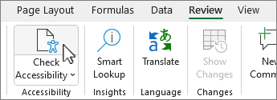

[Home](https://cityssm.github.io/accessibility-toolbox/)

# Microsoft Word Accessibility Checklist

**Under development. More checks coming.**

- [Ensure the document passes the "Basic Accessibility Checklist"](#-ensure-the-document-passes-the-basic-accessibility-checklist)
- [Run Word's "Accessibility Checker"](#-run-words-accessibility-checker)

## ✅ Ensure the document passes the "Basic Accessibility Checklist"

The "[Basic Accessibility Checklist](../basicAccessibilityChecklist/README.md)"
checks for details like language, colour contrast, and more.

## ✅ Run Word's "Accessibility Checker"

Built into Microsoft Word (and other Office applications), the Accessibility Checker
scans for (and helps to correct) accessibility issues in your documents.

[Learn more about the Accessibility Checker](https://support.microsoft.com/en-us/office/improve-accessibility-with-the-accessibility-checker-a16f6de0-2f39-4a2b-8bd8-5ad801426c7f)

## Additional Resources

[**Government of Canada - Accessible Word documents in Office 2016**](https://a11y.canada.ca/en/accessible-word-documents-in-office-2016/) 
Best practices identified by the Government of Canada for creating
accessible Word documents.
